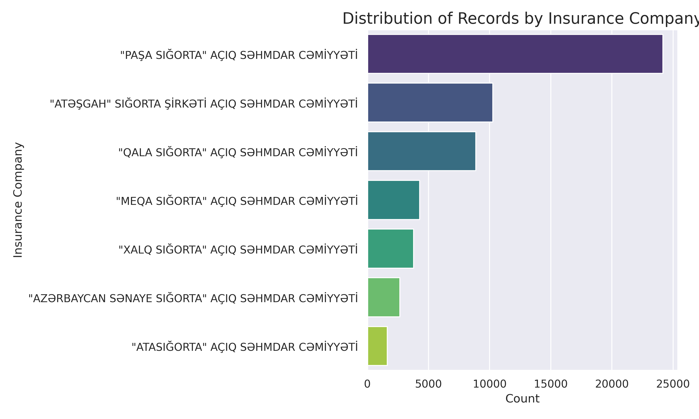
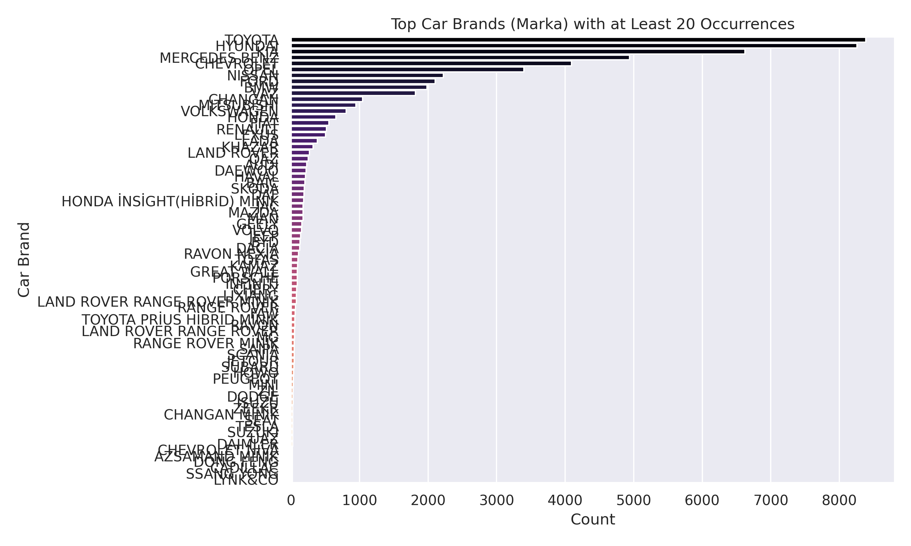
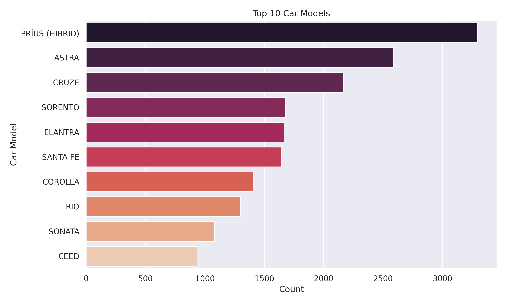
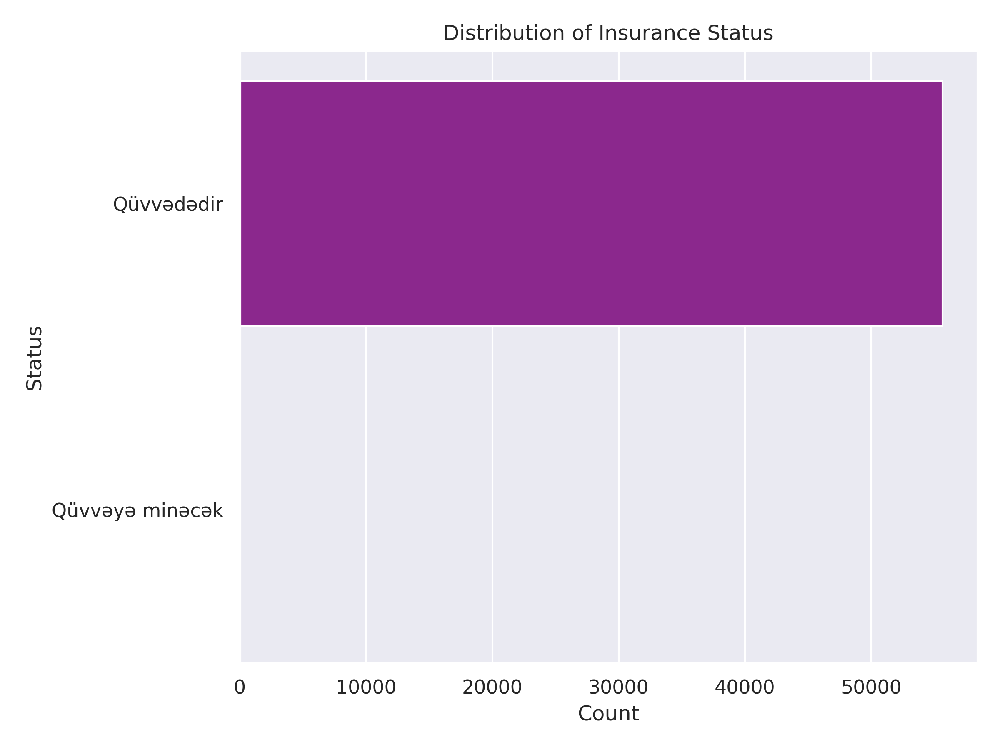
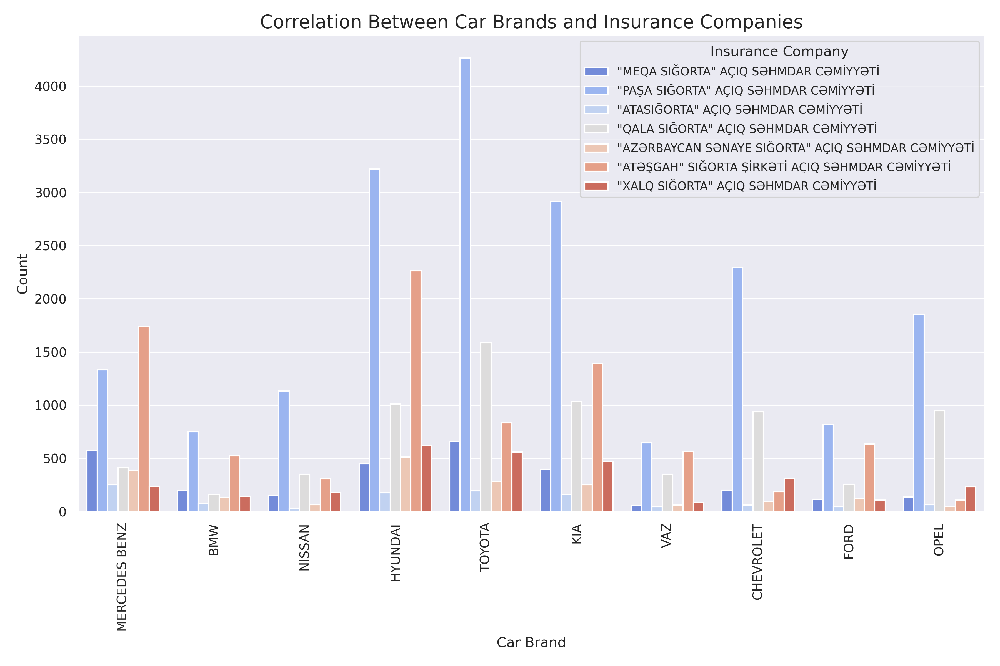
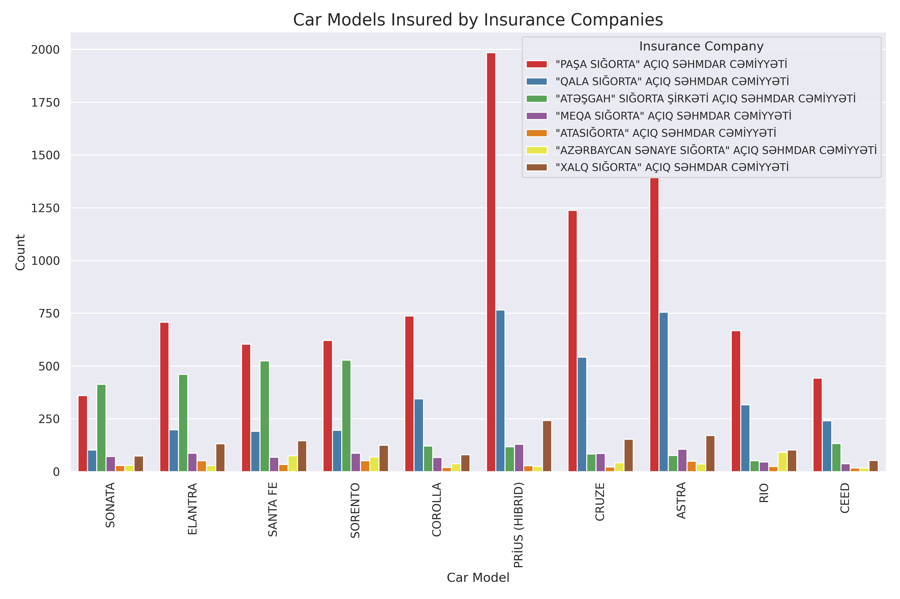
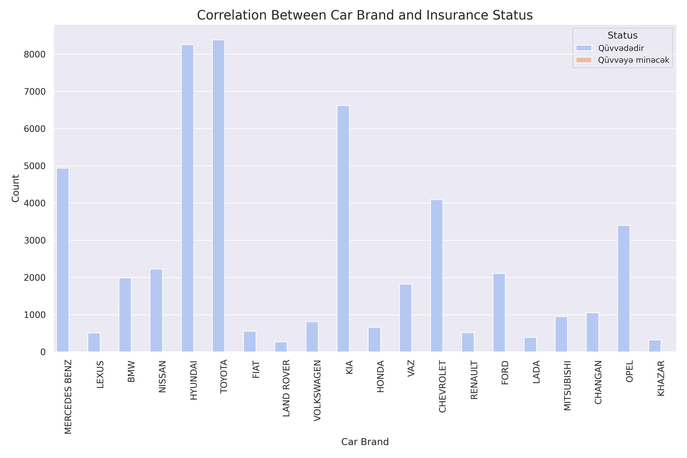
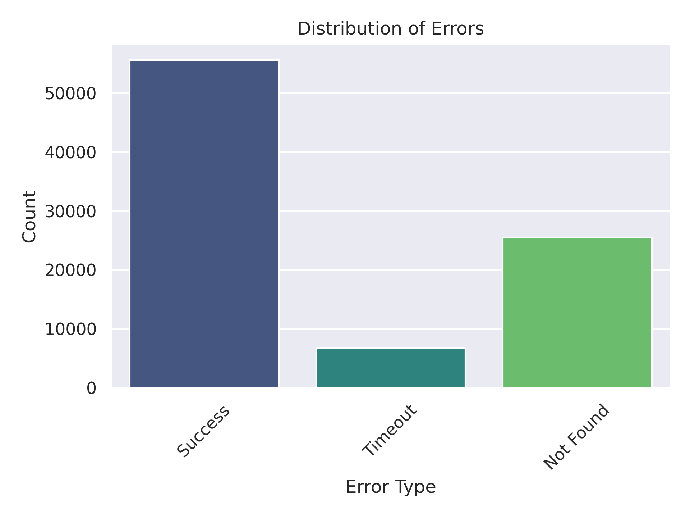

# ISB.az Car Insurance Data Scraper and Analyzer

## Overview
This project scrapes and analyzes car insurance data from ISB.az (İcbari Sığorta Bürosu Azərbaycan Respublikası). It collects information about cars including insurance status, car models, brands, and plate numbers using Playwright for Python. The collected data is then analyzed using Python data analysis tools and visualized through various plots.

## Features
- Automated web scraping of ISB.az using Playwright
- Dynamic data collection for individual plate numbers
- Comprehensive data analysis and visualization
- Logging system for tracking scraping progress
- Error handling and retry mechanisms
- Jupyter notebook integration for data analysis

## Project Structure
```
scraper-car/
├── images/                 # Generated plots and visualizations
├── notebooks/             # Jupyter notebooks for data analysis
├── output/                # Scraped data output
├── models/                # Data models and structures
├── logger/                # Logging configuration
├── scripts/               # Utility scripts
├── main.py               # Main scraping script
├── config.py             # Configuration settings
└── pyproject.toml        # Project dependencies and metadata
```

## Prerequisites
- Python 3.8+
- Playwright for Python
- Jupyter Notebook
- Required Python packages (specified in pyproject.toml)

## Installation

1. Clone the repository:
```bash
git clone https://github.com/kaimg/scraper-car.git
cd scraper-car
```

2. Create and activate a virtual environment:
```bash
# Using pip
pip install uv

uv venv
```

3. Install dependencies:
```bash
uv sync
```

4. Install Playwright browsers:
```bash
playwright install
```

## Usage

1. Run the scraper:
```bash
python main.py
```

2. View the analysis:
- Open Jupyter Notebook:
```bash
jupyter notebook notebooks/data_analysis.ipynb
```

## Data Analysis Results

The project includes various visualizations of the collected data:

### 1. Insurance Company Distribution

*Distribution of insurance policies across different companies*

### 2. Top Car Brands

*Most common car brands in the dataset*

### 3. Top 10 Car Models

*Most frequent car models*

### 4. Insurance Status Distribution

*Distribution of insurance status across the dataset*

### 5. Brand-Company Correlation

*Correlation between car brands and insurance companies*

### 6. Model-Company Correlation

*Correlation between car models and insurance companies*

### 7. Brand Status Correlation

*Correlation between car brands and insurance status*

### 8. Error Distribution

*Distribution of errors encountered during data collection*

## Error Handling
The scraper includes robust error handling mechanisms:
- Automatic retry for failed requests
- Comprehensive logging of errors
- Error statistics collection
